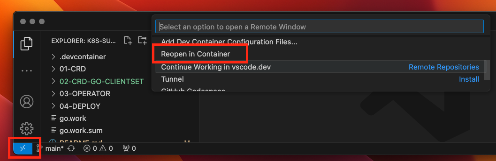

# K8S-Summit-2024-Operator101


|        |                                               |
|--------|-----------------------------------------------|
| Step-1 | [設計CRD](./01-CRD/README.md)                 |
| Step-2 | [生成CR API](./02-CRD-GO-CLIENTSET/README.md) |
| Step-3 | [撰寫 Operator](./03-OPERATOR/README.md)      |
| Step-4 | [部署](./04-DEPLOY/README.md)                 |


## 用 KinD 準備測試用K8S

```bash
kind create cluster --config 00-PREPARE/kind.yaml
```


## 用VSCode建立開發環境

VSCode 開啟 ntcu-workshop-2024 devcontainer


